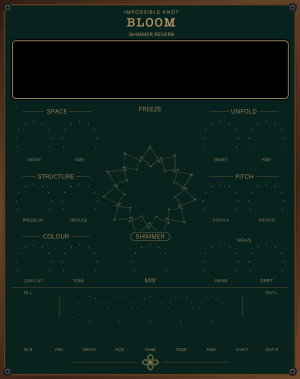

# Impossible Knot — BLOOM

BLOOM is a free shimmer reverb for VCV Rack 2 that lets you decide when the
octave arrives and how slowly it grows.

Most shimmer reverbs add a fixed delay before their pitch-shifted feedback.
BLOOM turns that moment into something playable: **ONSET** holds the shimmer
back, while **RISE** lets it unfold gradually. Play a phrase, leave space, and
hear the harmony open after the source has already disappeared.

The stereo Dattorro plate includes two independent pitch voices, phrase-aware
arrival shaping, pitch-locked freeze, 1 V/oct control over voice A, extensive
CV, five factory presets, and selectable classic and organic displays.

## Documentation

- [User manual](MANUAL.md)
- [Control reference](CONTROL-REFERENCE.md)
- [Changelog](CHANGELOG.md)

## Availability

BLOOM 2.0.0 is a closed-source freeware release candidate for the VCV
Library. It will be free to add to a VCV account and use in Rack once accepted.

The official binary may be used in personal and commercial music and audio
work under the bundled [proprietary freeware licence](LICENSE.txt). The source
code and artwork masters are not published or licensed for reuse.

## Support

Email [hello@impossible-knot.com](mailto:hello@impossible-knot.com).

VCV Rack is a product of VCV. See [third-party notices](THIRD_PARTY_NOTICES.txt)
for attribution and dependency terms.
